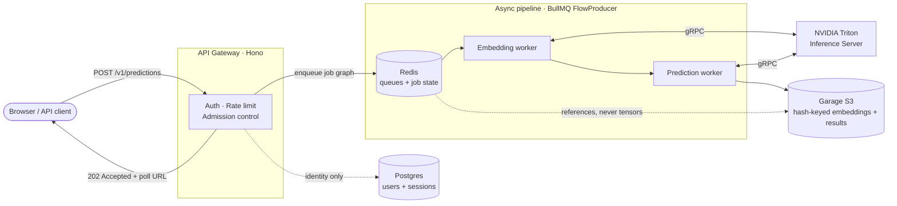

# protifer

> **Production protein-feature inference.** Submit a protein sequence; get per-residue and per-protein ML predictions — secondary structure, disorder, binding, conservation, transmembrane topology, variant effects, subcellular localization, and Gene Ontology terms — with 3D structure and UniProt enrichment.

## What it is

protifer turns a raw protein sequence into a rich feature profile. A user pastes a sequence in the browser; the backend runs it through a protein language model on GPU and returns a set of per-residue and per-protein predictions, alongside a 3D structure view and UniProt annotations.

The interesting part isn't the models — it's the system around them. Inference is GPU-bound and slow, so every request is admitted, queued, and processed asynchronously; identical sequences worldwide share a single content-addressed result, so the GPU never recomputes a known answer; and the whole thing is multi-tenant, with per-plan rate limits and admission SLOs that keep paying traffic fast when the cluster is saturated.

<!--
  HERO SCREENSHOT/GIF GOES HERE — the prediction flow (paste sequence → results).
  When captured, embed it here with:
  
-->

## Architecture

A request never blocks on the GPU. The **API gateway** (Hono) authenticates, rate-limits, and runs **admission control**, then enqueues a BullMQ **`FlowProducer`** job graph on Redis and returns `202 Accepted` with a polling URL. An **embedding worker** calls **NVIDIA Triton** over gRPC to produce sequence embeddings; a **prediction worker** consumes those to produce the final results. The storage boundaries are deliberate: **Postgres** holds only identity (users + better-auth sessions), **Redis** holds queue state and _references_ to results — never the tensors — and **Garage (S3)** holds hash-keyed, immutable embeddings and results.

## The interesting engineering

These are the parts that were genuinely hard, and the tradeoffs they cost.

### Triton gRPC model serving

Models are served by NVIDIA Triton and called over a typed gRPC client rather than HTTP — lower per-call overhead on the hot path, with model names encoded in the type system so a wrong model config fails at compile time, not at inference. → [`packages/triton-client`](packages/triton-client)

### Chained job pipelines (FlowProducer)

Embedding → prediction is a parent/child BullMQ flow built with `FlowProducer`, with shared retry/backoff defaults and SIGTERM-draining workers. The tradeoff is deliberate: a two-stage linear pipeline doesn't justify a workflow engine like Temporal, so there's no extra server to run — revisit only if the pipeline gains branching or human-in-the-loop steps. → [`packages/shared/src/queue.ts`](packages/shared/src/queue.ts)

### Request shedding with per-plan SLOs

Under saturation the gateway sheds load by class: each plan has a queue-wait SLO (free 30s, pro 120s, enterprise top-priority) and over-SLO requests get `503 + Retry-After`, while BullMQ job priority drains paying tiers first. It ships in shadow mode and flips to enforce per-flag or via `SHED_MODE` — so you can watch what it _would_ shed before it sheds anything. → [`services/api-gateway/src/shedding/`](services/api-gateway/src/shedding)

### OpenFeature flags via a custom Bun-verified provider

Feature flags go through the vendor-neutral OpenFeature SDK, backed by a custom in-process provider (registry + 5s-cached store) verified to run on Bun. App code only ever calls `getBooleanValue(name, default, ctx)`; swapping to a hosted backend (LaunchDarkly, Statsig) is a one-line `setProvider` at boot. Flags are declared with type, owner, targeting, and expiry, and a CI lint rejects expired or undeclared references. → [`packages/shared/src/flags/`](packages/shared/src/flags)

### Correlation & observability

Every pino log line emitted while a request or job is in flight carries `requestId`, `traceId`, and `spanId`, stamped by a shared mixin that reads the active span through the vendor-neutral `@opentelemetry/api` — so swapping the exporter (Sentry → OTLP) touches zero log code. The gateway exposes a `prom-client` registry with HTTP, shedding, and BullMQ pipeline metrics: queue depth, wait/processing latency histograms, and a closed failure-reason taxonomy. → [`packages/shared/src/correlation.ts`](packages/shared/src/correlation.ts), [`services/api-gateway/src/metrics.ts`](services/api-gateway/src/metrics.ts)

### Dual-reader secret/config design

Two readers with opposite precedence make the security posture declarative: `readSecret` is file-wins (`NAME_FILE` before `NAME`) to match the Docker/k8s secret convention and minimize env-leak surface, while `readConfig` is env-wins to match 12-factor tunables. Each schema field picks its reader via `secretField()` / `configField()`. → [`packages/shared/src/secrets.ts`](packages/shared/src/secrets.ts)

## A few decisions worth defending

The conditions that would reverse each are noted inline.

- **BullMQ over Temporal** — a two-stage linear pipeline needs no workflow engine and no extra server to operate. (ADR-001)
- **Content-addressed job IDs** — `sha256(sequence:model:version:config)` means identical submissions worldwide share one job and one cached result, giving free idempotency and maximal GPU-cache hits. The tradeoff: results aren't per-user. (ADR-004)
- **Plan tier as application data, not identity** — entitlements resolve in-app from Postgres (Redis-cached), never from the OAuth token, so the auth provider stays swappable. (ADR-002, ADR-006)

## Repository map

| Path                         | Role                                                                            |
| ---------------------------- | ------------------------------------------------------------------------------- |
| `apps/web`                   | React 19 + Vite SPA (TanStack Router, shadcn/ui) — [README](apps/web/README.md) |
| `services/api-gateway`       | Hono REST API — auth, rate limiting, admission control, job submission          |
| `services/embedding-worker`  | BullMQ consumer → Triton → S3 (sequence embeddings)                             |
| `services/prediction-worker` | BullMQ consumer → Triton → S3 (downstream predictions)                          |
| `packages/shared`            | Types, `ObjectStore`, `AppError`, logger, plan limits, BullMQ + flags + config  |
| `packages/triton-client`     | Typed gRPC client and model-name types for Triton                               |
| `infra`                      | Docker Compose, migrations, storage + Triton setup                              |

## Run it locally

You need [Bun](https://bun.sh) for everything; integration tests and the full pipeline also need Docker (Redis, Postgres, Garage, a mock Triton) brought up from `infra/`.

| Command             | Description                                      |
| ------------------- | ------------------------------------------------ |
| `bun install`       | Install all workspace dependencies               |
| `bun run dev`       | Start all apps and services in parallel          |
| `bun run build`     | Build all workspaces                             |
| `bun run typecheck` | TypeScript check across all workspaces           |
| `bun run test`      | Unit + component tests                           |
| `bun run test:int`  | Integration tests (requires the Docker stack up) |
| `bun run lint`      | ESLint across all workspaces                     |

Individual workspaces run the same scripts from their own directory.

## Learn more

- [Web app](apps/web/README.md) — frontend structure and dev commands
